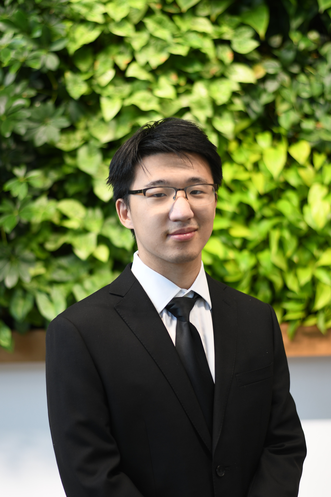

---
# Feel free to add content and custom Front Matter to this file.
# To modify the layout, see https://jekyllrb.com/docs/themes/#overriding-theme-defaults

layout: default

---

{: style="width: 200px"}
<!-- ## Jingkun (Allen) Liu -->
## Skills
<!-- **Programing Skills:**
 - C/C++
 - Python
 - Java/Kotlin
 - HTML/CSS
 - JavaScript
 - TypeScript
 - Swift
 - XML

**Software Skills:**
 - ROS/ROS2
 - Linux
 - MS Office
 - Xcode
 - Android Studio
 - SolidWorks/CAD
 - MATLAB/Simulink
 - Xilinx ISE
 - ANSYS -->

<table>
<tr>
<th> Programing </th>
<th> Software </th>
</tr>
<tr>
<td>

 R, C/C++/C#, Python, Java/Kotlin, HTML/CSS, JavaScript/TypeScript, Swift, XML, SQL

</td>
<td>

 ROS/ROS2, Linux, MS Office, Xcode, Android Studio, SolidWorks/CAD, MATLAB/Simulink, Xilinx ISE Design Suite, ANSYS

</td>
</tr>
</table>
<!-- 
| Syntax      | Description |
| ----------- | ----------- |
| Header      | Title       |
| Paragraph   | Text        | -->